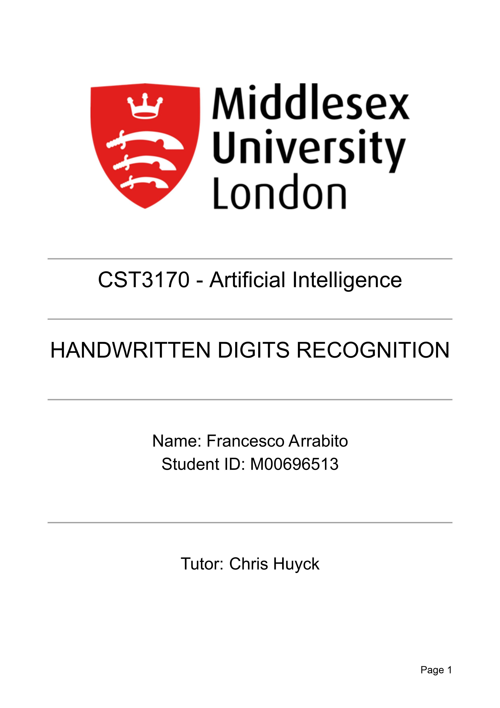
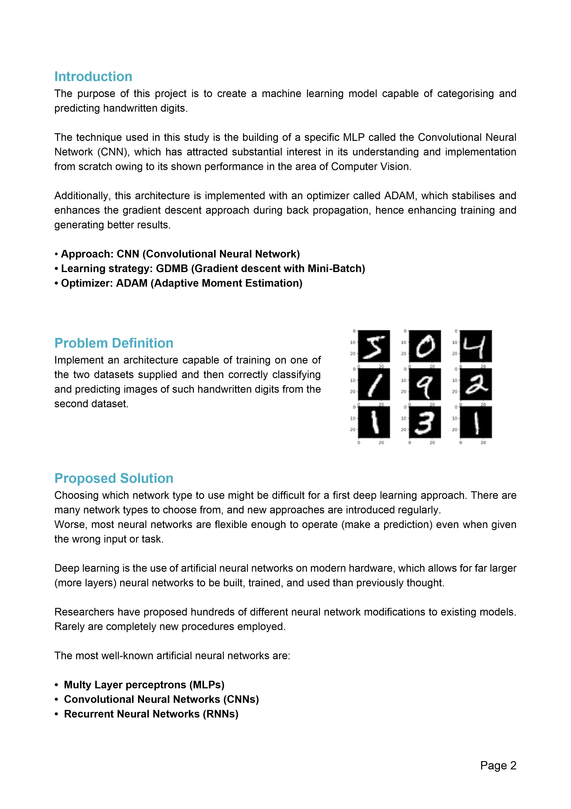
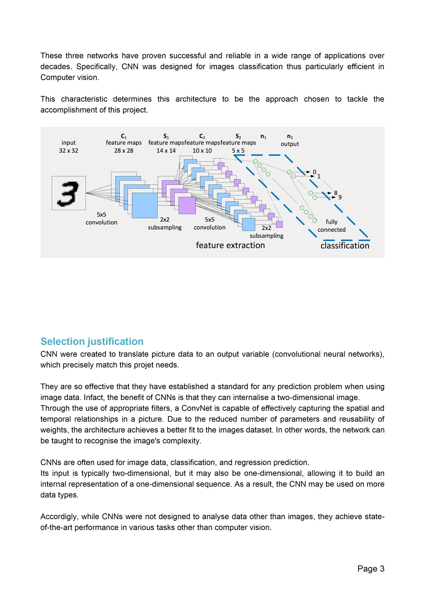
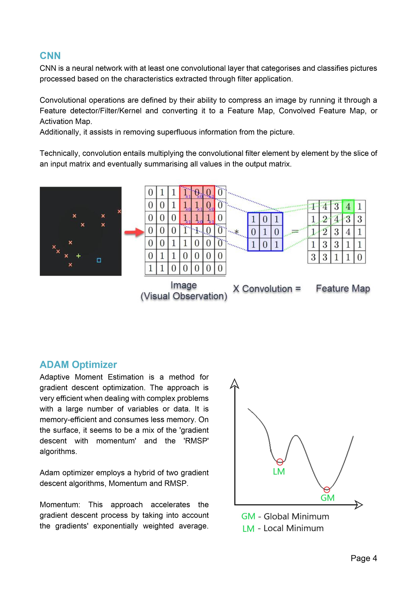
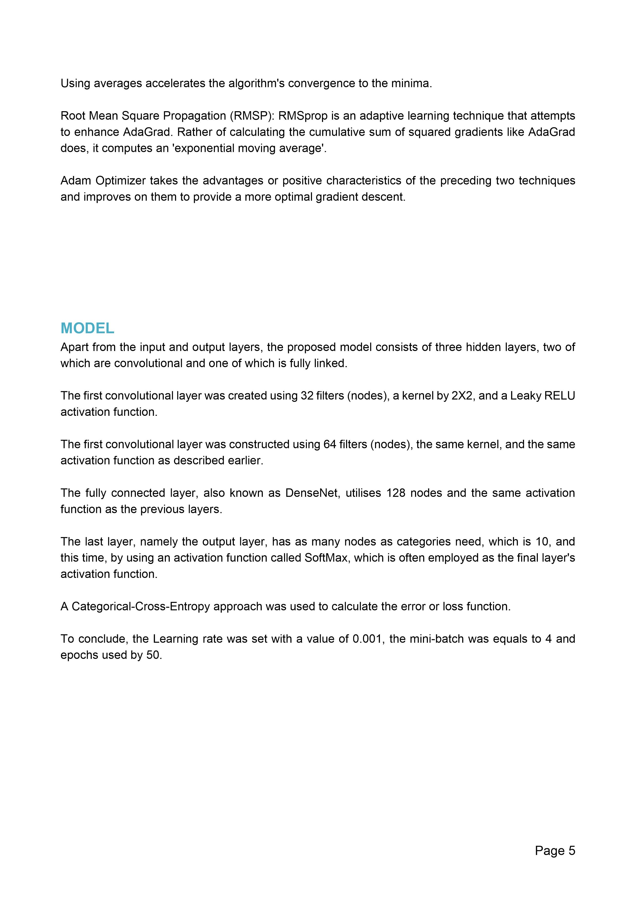
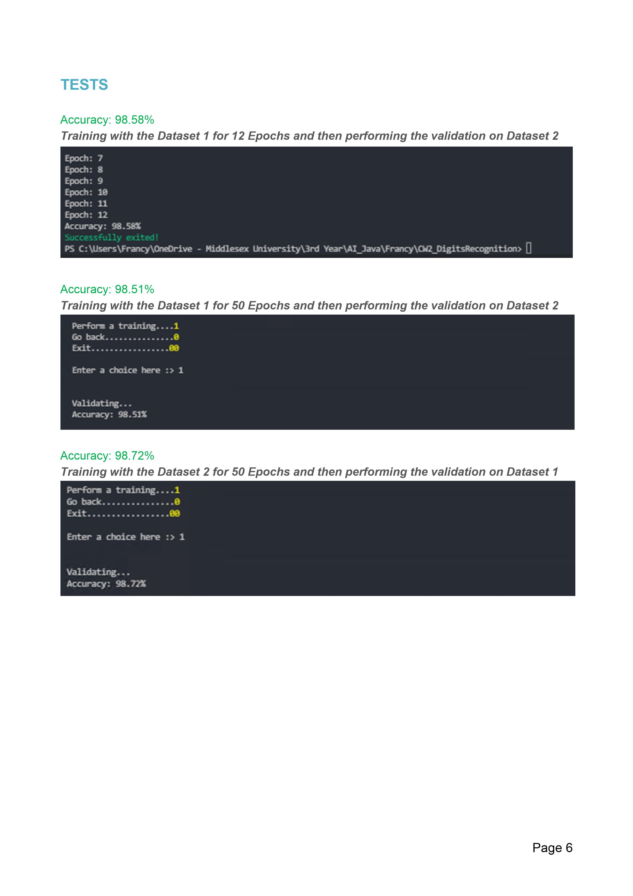

<p align="center">
  
  <summary align="center">
    <font color="blue">
      <h1 align="center">Deep Learning</h1>
    </font>
  </summary>
  <p align="center">AI: Second project of the Computer Science third-year is about Convolutional Neural Networks (CNN)</p>
</p>


<font color="blue"><h2>Convolutional Neural Network 🧠</h2></font>
This project is about Convolutional Neural Networks (CNN) and is the second project of the Computer Science third-year course.

<font color="blue"><h3>Overview 📚</h3></font>
Convolutional Neural Networks (CNN) are a type of neural network that have been widely used in image and video recognition. CNNs are inspired by the structure of the animal visual cortex and can automatically learn to recognize visual patterns such as edges and shapes.
The maximum accuracy reached was 99.04% in 81 epochs.

In this project, I implemented a CNN from scratch using Java without any machine learning related library, and trained the model on a mnist dataset, which consists of 2,810 8x8 gray-scale images in 10 classes. I also used Google Colab for this project, which is a free cloud-based Jupyter notebook environment that provides access to testing environments.

<font color="blue"><h3>Try it out on Google Colab 🚀</h3></font>
You can try out this implementation of CNN on Google Colab by clicking on this link: 
<a href="https://colab.research.google.com/drive/1UjcC4Cm2_UlceRvDiEEb3FQzJLsSwNjr#scrollTo=VWjk2um_hSyR"></a>

```
https://colab.research.google.com/drive/1UjcC4Cm2_UlceRvDiEEb3FQzJLsSwNjr?usp=sharing
```


<font color="blue"><h3>Report 📝</h3></font>
Here is the report:







